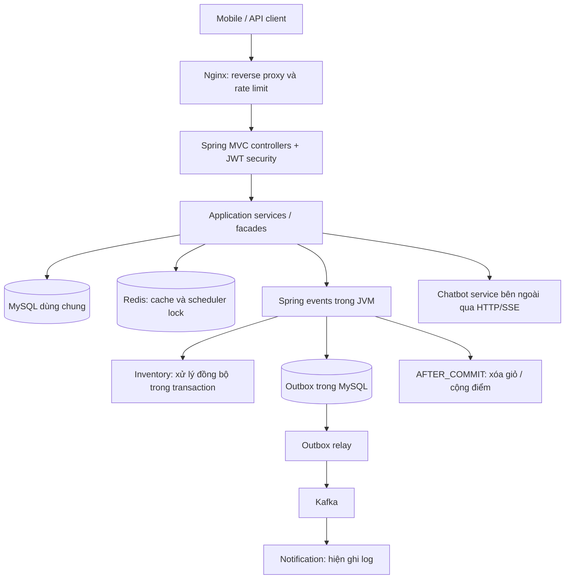

# Báo cáo đánh giá backend BeautyShop

Ngày đánh giá: 23/09/2026. Phạm vi: mã nguồn đang có trong working tree, gồm cả thay đổi chưa commit.

**Kết luận:** Backend có nền tảng modular monolith rõ ràng, phân tách nghiệp vụ hợp lý, đã đầu tư vào bảo mật, transaction, cache, outbox và kiểm thử kiến trúc. Tuy nhiên, chưa đủ bằng chứng để công bố khả năng chịu tải cụ thể hoặc coi hệ thống đã sẵn sàng vận hành thương mại ổn định. Cần ưu tiên tính đúng đắn khi xử lý đồng thời, vòng đời tồn kho/vé Spa, độ bền của sự kiện và pipeline triển khai.

**Phạm vi và cách đọc kết quả**

- Kiểm kê 287 file Java chính, 31 file Java test; đọc sâu các service, repository, controller và cấu hình liên quan đến luồng trọng yếu. Đây không phải tuyên bố đã kiểm toán từng dòng của toàn bộ mã nguồn.
- Đọc bổ sung Docker Compose, Dockerfile, Nginx và GitHub Actions để đánh giá cách vận hành backend.
- Chạy bộ test có sẵn; kết quả và giới hạn được ghi ở cuối báo cáo.
- “Xác nhận từ code” là hành vi nhìn thấy trực tiếp; “rủi ro đồng thời” là kịch bản suy ra từ transaction/locking, chưa phải sự cố được tái hiện bằng tải thực.
- Chưa chạy benchmark, chưa kiểm thử tích hợp toàn hệ thống với MySQL/Redis/Kafka thật và chưa kiểm thử SePay bên ngoài.

**1. Kiến trúc tổng thể**

Stack khai báo: Java 21, Spring Boot 3.4.3, Spring MVC, Spring Security, JPA/Hibernate, MySQL, Redis, Kafka, Flyway, ShedLock, Actuator/Prometheus, Lombok, JUnit/Mockito/ArchUnit.

Đây là modular monolith: một ứng dụng deploy, một transaction manager và database dùng chung. Kafka không khiến các module tự động trở thành microservices. Chatbot là tích hợp HTTP với tiến trình bên ngoài.

| Module | Trách nhiệm |
|---|---|
| identity | Tài khoản, vai trò, JWT, refresh session, thu hồi token, hội viên và điểm |
| catalog | Sản phẩm, biến thể, thương hiệu, danh mục, ảnh, thuộc tính, thành phần và dữ liệu da |
| cart | Giỏ khách vãng lai/thành viên, cập nhật và gộp giỏ |
| inventory | Kho, lô hàng, tồn khả dụng, giữ/nhả/trừ/hoàn tồn, xử lý hạn dùng |
| order | Checkout, giá snapshot, trạng thái đơn, lịch sử và phát sự kiện |
| payment | Chiến lược thanh toán, hướng dẫn chuyển khoản, webhook SePay |
| spa | Dịch vụ, gói liệu trình, vé, nhân viên và lịch hẹn |
| notification | Nhận sự kiện Kafka và xử lý thông báo |
| chatbot | Proxy chat, SSE, health và đồng bộ dữ liệu RAG |
| shared | Cấu hình, security, lỗi/DTO dùng chung, audit và outbox |

Phần lớn module chia `api → application → domain`. Domain chứa JPA entity và Spring Data repository; nghiệp vụ chủ yếu ở service. Đây là kiến trúc phân lớp theo module, mang phong cách service-centric; chưa phải Clean Architecture với domain độc lập framework. Ví dụ `ProductRepository` trong domain trả DTO thuộc application; một số response có hàm `of(entity)`.

Điểm tốt: facade và DTO công khai giúp module không lấy trực tiếp entity/repository của nhau; order/cart/inventory tham chiếu module khác bằng ID. Sáu test ArchUnit kiểm tra ranh giới repository/domain. Điểm còn thiếu: các test chưa bao quát toàn bộ phụ thuộc vào `application`, chu kỳ module và hướng phụ thuộc của `shared`. Chẳng hạn order và payment gọi facade lẫn nhau, nên tách service độc lập sau này vẫn cần thiết kế lại giao thức nghiệp vụ.

Nguồn: [pom.xml](pom.xml), [Architecture test](src/test/java/com/core/beautyshop/architecture/ModularArchitectureTest.java), [ProductRepository](src/main/java/com/core/beautyshop/modules/catalog/domain/ProductRepository.java).

**2. Logic nghiệp vụ thực tế**

**Tài khoản và bảo mật.** Đăng ký kiểm tra username/email, gán vai trò mặc định; mật khẩu dùng BCrypt. Access token mặc định 15 phút, refresh token 7 ngày. Refresh token được hash SHA-256 trước khi lưu, có family, rotation và phát hiện tái sử dụng. Logout tăng token version để thu hồi access token. Request chạy stateless; quyền kiểm tra tại security config, method security và quyền sở hữu tài nguyên trong service. Webhook được mở ở security filter nhưng controller có kiểm tra API key riêng, nên không phải webhook vô xác thực.

**Catalog và giỏ hàng.** Danh sách sản phẩm dùng DTO projection; chi tiết/danh sách phổ biến được cache Redis. Checkout lấy giá lại từ catalog, không tin giá do client gửi. Các truy vấn variant phục vụ mua hàng yêu cầu variant active, product active và chưa xóa. Giỏ guest dùng session ID; giỏ thành viên dùng user ID. Thêm giỏ chỉ kiểm tra khả dụng, chưa giữ hàng. Khi merge giỏ, các item vượt tồn bị bỏ qua và giữ lại trong giỏ guest.

**Checkout và vòng đời đơn.** Service đọc giỏ, batch-load các variant, sắp xếp variant ID rồi reserve stock, snapshot tên/SKU/giá vào order item, tính tiền và lưu đơn cùng lịch sử. Shipping fee hiện được factory đặt bằng 0. Membership discount tính trên subtotal, tổng giảm bị chặn trong khoảng hợp lệ. Đơn và outbox được ghi trong transaction; giỏ được xóa sau commit.

Luồng chính: `PENDING → CONFIRMED → PROCESSING → SHIPPED → DELIVERED`; code cũng cho `PENDING → PROCESSING`. Khách chỉ tự hủy khi PENDING; admin có nhánh chuyển trạng thái rộng hơn. Hủy nhả tồn giữ chỗ, giao thành công trừ tồn vật lý, trả hàng cộng tồn trở lại.

**Thanh toán.** Enum thực tế là `COD` và `BANK`. Strategy tạo hướng dẫn phù hợp. Webhook lọc giao dịch tiền vào, trích `ORD-XXXXXXXX`, kiểm tra reference đã xử lý, khóa đơn và cộng dồn `paidAmount`. Đủ tiền thì đánh dấu PAID; đơn PENDING chuyển PROCESSING. Nếu tiền tới sau khi hủy, code ghi chú cần refund, chưa thấy luồng thực hiện refund. Không thấy nhánh hoàn tất thanh toán COD tương ứng khi giao hàng; vì vậy trạng thái giao vận và thanh toán có thể lệch nhau.

**Tồn kho và hạn dùng.** FEFO chọn lô có hạn gần nhất trước, lô không hạn sau. Câu UPDATE có điều kiện giúp không reserve vượt tồn hiện thời. Tồn khả dụng bỏ qua lô hết hạn. Job 01:00 kiểm tra lô: chỉ còn lô hết hạn thì ngừng bán variant; toàn bộ lô còn hạn sắp hết trong 30 ngày và chưa có discount thì giảm 20%. Job hiện đọc toàn bộ kho và quyết định ở cấp variant.

**Spa.** Mua gói tạo đơn BANK; sau thanh toán phát sự kiện cấp vé, chống cấp trùng theo order. Tổng lượt vé là tổng quantity của các mục trong gói. Đặt lịch yêu cầu đăng nhập, kiểm tra thời gian tương lai, giờ mở cửa 08:00–20:00, tính cả thời gian chuẩn bị và xếp dịch vụ liên tiếp. Khi chọn staff, khóa staff và kiểm tra trùng lịch. Vé được kiểm tra chủ sở hữu, đơn đã trả tiền, thời hạn, trạng thái, số buổi và dịch vụ có thuộc gói hay không. Số buổi bị trừ ngay lúc đặt lịch; hủy hoàn lượt.

**Hội viên.** Mỗi 10.000 đơn vị tiền của tổng đơn giao thành công tạo khoảng 1 điểm theo phép chia/lấy phần nguyên. Ngưỡng MEMBER/SILVER/GOLD/PLATINUM là 0/1.000/5.000/10.000 điểm; giảm tương ứng 0/5/10/15%. Cộng điểm khóa user và có bảng award chống cộng lặp theo order. Chưa thấy hoàn điểm khi trả hàng.

**Notification và chatbot.** Notification hiện ghi log, chưa gửi email thật. Backend chatbot chỉ chuyển tiếp HTTP/SSE; không thể từ folder backend kết luận chất lượng mô hình, RAG hay năng lực GPU.

Nguồn chính: [OrderServiceImpl](src/main/java/com/core/beautyshop/modules/order/application/service/OrderServiceImpl.java), [OrderFactory](src/main/java/com/core/beautyshop/modules/order/application/factory/OrderFactory.java), [AuthServiceImpl](src/main/java/com/core/beautyshop/modules/identity/application/service/AuthServiceImpl.java), [InventoryServiceImpl](src/main/java/com/core/beautyshop/modules/inventory/application/service/InventoryServiceImpl.java), [AppointmentServiceImpl](src/main/java/com/core/beautyshop/modules/spa/application/service/impl/AppointmentServiceImpl.java), [MembershipTier](src/main/java/com/core/beautyshop/modules/identity/domain/enums/MembershipTier.java).

**3. Các phát hiện cần ưu tiên**

P1: nên sửa trước khi vận hành có giao dịch thật/tải đồng thời. P2: hoàn thiện trước khi mở rộng. Các rủi ro đồng thời bên dưới cần bổ sung integration test trên MySQL để xác nhận interleaving và cơ chế sửa.

| Mức | Phát hiện và bằng chứng | Tác động / hướng xử lý |
|---|---|---|
| P1 | `OrderServiceImpl.updateOrderStatus/cancelOrder` dùng `findById`, không khóa; `Order` và `Base` không có `@Version` | Hai request có thể cùng đọc trạng thái cũ rồi cùng phát side effect trừ/nhả/hoàn tồn. Khóa aggregate hoặc dùng version/conditional update và bảo đảm transition chỉ thắng một lần. |
| P1 | Checkout không có cơ chế xử lý `Idempotency-Key`; chỉ thấy header được cho phép trong CORS | Hai request cùng đọc giỏ trước khi xóa có thể tạo hai đơn và reserve hai lần nếu đủ tồn. Lưu idempotency key gắn user/session, request hash và kết quả trong DB; không chỉ khóa thao tác xóa giỏ. |
| P1 | Nhánh `case CANCELLED` chỉ loại DELIVERED và CANCELLED | Cho phép `RETURNED → CANCELLED`, sau khi đã hoàn hàng lại chạy release reservation. Có thể lỗi hoặc nhả tồn của đơn khác. Định nghĩa bảng chuyển trạng thái rõ và cấm chuyển từ trạng thái kết thúc. |
| P1 | Inventory API nhận variant ID + quantity; không có liên kết reservation với order item và batch | Không truy vết được đơn nào giữ lô nào. `returnStock` chọn một lô còn hạn bất kỳ thay vì lô gốc, có thể làm hàng trả về mang hạn dùng sai. Thêm stock reservation/allocation và ledger theo order item, batch, quantity; hàng trả cần bước kiểm tra chất lượng. |
| P1 | `AppointmentServiceImpl.updateAppointmentStatus` chỉ chặn rời COMPLETED, vẫn cho mở lại lịch CANCELLED | Hủy đã hoàn lượt vé; mở lại không trừ lại lượt và không kiểm tra trùng staff. Có thể phục vụ không tiêu lượt hoặc trùng lịch. Chặn hồi sinh lịch hủy hoặc triển khai đầy đủ nghiệp vụ đặt lại. |
| P1 | Hủy/cập nhật lịch đọc appointment không khóa; chỉ khóa ticket sau đó | Khóa ticket không bảo vệ việc hai request cùng thấy appointment chưa hủy. Có nguy cơ hoàn lượt hai lần, làm giảm lượt của lịch khác trên cùng vé. Khóa appointment trước khi kiểm tra trạng thái, giữ thứ tự khóa nhất quán. |
| P1 | `GlobalExceptionHandler` đưa `getRejectedValue()` vào response và log; request đăng ký có validation password | Password sai độ dài có thể xuất hiện nguyên văn trong response/log. Loại hoặc mask rejected value cho password/token/secret; chỉ log field và mã lỗi. |
| P1 | `FlywayConfig` gọi `repair()` trước mỗi `migrate()` | Làm suy yếu khả năng phát hiện migration đã bị sửa checksum. Không tự repair lúc khởi động; migration đã áp dụng cần bất biến, repair là thao tác vận hành có kiểm soát. |
| P1 | Dockerfile COPY `target/*.jar`; job build image checkout mới, không package hoặc tải JAR; job CI trước chỉ compile/test | Với pipeline hiện tại, checkout sạch thiếu JAR để build image. Dùng multi-stage Docker build hoặc package rồi upload/download artifact. `needs` chỉ tạo thứ tự job, không truyền filesystem. |
| P2 | Listener xóa giỏ và cộng điểm chạy AFTER_COMMIT, catch lỗi rồi chỉ log | Có thể commit đơn thành công nhưng mất việc xóa giỏ/cộng điểm do crash hoặc lỗi DB. Đưa công việc cần bảo đảm vào outbox/durable job; thêm retry và reconciliation. |
| P2 | Webhook cho reference null và sinh reference từ thời gian; check exists rồi ghi sau | Request thiếu mã ổn định không có dedup bền vững. Trùng đồng thời có unique constraint bảo vệ DB nhưng nhánh catch broad dễ che rollback/lỗi commit. Bắt buộc provider event ID, transaction hóa việc nhận event; trả kết quả duplicate rõ ràng. Không kết luận rằng duplicate có reference chắc chắn bị cộng tiền hai lần. |
| P2 | Webhook không đối chiếu tài khoản nhận tiền cấu hình; các trường hợp không tìm thấy đơn/amount sai có thể được phân loại PARTIALLY_PAID | Cần phân biệt ignored/unmatched/invalid/partial/success và kiểm tra thuộc tính giao dịch phù hợp; thêm đối soát. |
| P2 | Vé gói Spa chỉ có tổng lượt, booking chỉ kiểm tra service thuộc gói | Gói gồm 1 lượt A và 3 lượt B có thể bị dùng 4 lượt A. Nếu quantity là quyền lợi riêng từng dịch vụ, cần balance theo service và snapshot quyền lợi lúc mua. |
| P2 | Booking chưa thấy kiểm tra staff active/skills, service active/soft-delete, công suất cơ sở khi bỏ trống staff | Có thể nhận lịch không đủ nguồn lực. Cần xác định lịch chưa gán staff là yêu cầu chờ xác nhận hay cam kết slot; bổ sung quy tắc tương ứng. |
| P2 | Chưa thấy reservation TTL/job hết hạn đơn chưa thanh toán | Đơn PENDING bỏ dở có thể giữ tồn lâu dài. Thêm payment deadline, giải phóng giữ chỗ idempotent và xử lý tiền tới muộn. |
| P2 | Các luồng hoàn tiền, hoàn điểm khi trả hàng, xác nhận thu COD chưa hoàn chỉnh | Đơn, tồn kho, thanh toán và hội viên có thể không đồng bộ về nghiệp vụ. Cần đặc tả chính sách và luồng đối soát cụ thể. |

Nguồn bổ sung: [OrderRepository](src/main/java/com/core/beautyshop/modules/order/domain/OrderRepository.java), [AppointmentRepository](src/main/java/com/core/beautyshop/modules/spa/domain/AppointmentRepository.java), [GlobalExceptionHandler](src/main/java/com/core/beautyshop/shared/exception/GlobalExceptionHandler.java), [PaymentWebhookServiceImpl](src/main/java/com/core/beautyshop/modules/payment/application/service/PaymentWebhookServiceImpl.java), [FlywayConfig](src/main/java/com/core/beautyshop/shared/config/FlywayConfig.java), [CI](../.github/workflows/ci-cd.yml), [Dockerfile](Dockerfile).

**4. Khả năng chịu tải**

Không có kết quả benchmark để quy đổi thành số người dùng đồng thời/RPS. Cấu hình 10.000 connection không phải bằng chứng phục vụ tốt 10.000 request nghiệp vụ cùng lúc. Số user đăng ký, socket đang mở, request đang xử lý và DB transaction là các đại lượng khác nhau.

| Thành phần | Cấu hình / hành vi quan sát | Đánh giá |
|---|---|---|
| HTTP | Virtual threads bật; Tomcat khai báo max threads 200, accept count 2.000, max connections 10.000 | Có lợi với chờ I/O nhưng không tăng năng lực DB. Không dùng con số 200 để suy ra giới hạn worker khi virtual threads được bật. |
| HikariCP | Max 15, min idle 5, chờ connection 10 giây | Các luồng DB-bound tranh 15 connection mỗi instance. Transaction dài, chờ row lock và REQUIRES_NEW làm tăng áp lực. |
| Redis | Cache TTL mặc định 5 phút; cache transaction-aware; local fallback là ConcurrentMapCacheManager được chọn qua config | Hữu ích cho catalog; chưa thấy cơ chế tự failover cache khi Redis lỗi. Local cache không TTL/bound theo cấu hình này và không đồng bộ giữa instance. |
| MySQL | Compose max connections 200, buffer pool 384 MB, một instance | Đây là cấu hình nhỏ cho phát triển/demo; khả năng thực phụ thuộc dữ liệu, CPU/RAM/IOPS và query. |
| Kafka | 3 partitions/topic, replication factor 1, một broker | Có nền tảng tách notification; chưa có HA. Producer idempotence không tự chống duplicate nghiệp vụ sau relay restart. |
| Nginx | API 30 request/giây/IP, auth 5 request/giây/IP, burst; một upstream | Đã có rate limit ở gateway. Nhiều khách chung NAT có thể tranh quota; không thấy giới hạn concurrent stream riêng. |
| Triển khai | Một backend, DB, Redis, Kafka | Chưa có bằng chứng HA hoặc scale ngang đã được kiểm chứng. Tăng replica backend cần tính lại tổng DB connections và các race đã nêu. |

Spring Boot xác nhận khi bật virtual threads, các thuộc tính điều chỉnh thread pool không còn mang ý nghĩa như chế độ pool thông thường: [tài liệu Spring Boot](https://docs.spring.io/spring-boot/reference/features/spring-application.html).

Các nút thắt đáng chú ý:

1. **Phân trang collection fetch đã có cảnh báo thực tế.** `OrderRepository` và `AppointmentRepository` dùng `Page` cùng entity graph chứa collection `items`. Lần chạy test ghi `HHH90003004: firstResult/maxResults specified with collection fetch; applying in memory`. Đây là bằng chứng phân trang trong RAM xảy ra với truy vấn được test, không chỉ suy đoán từ annotation. Khi dữ liệu lớn, request một trang nhỏ vẫn có thể kéo rất nhiều bản ghi. Chuyển sang page ID rồi fetch chi tiết theo tập ID, hoặc dùng projection. Bật fail-on-pagination-over-collection-fetch trong test để bắt tái phát. Cơ chế được mô tả tại [Hibernate 6.6](https://docs.hibernate.org/orm/6.6/querylanguage/html_single/).
2. **Outbox relay xử lý tuần tự.** Batch 50, mỗi lần send chờ `.get(30s)`, fixed delay 1,5 giây. Trong điều kiện lý tưởng thời gian xử lý gần 0, trần xấp xỉ 50/1,5 = 33,3 message/giây cho một relay đang giữ lock; thực tế thấp hơn. Đây là trần suy ra từ vòng lặp, không phải benchmark toàn backend. Khi backlog lớn cần batch/asynchronous send có giới hạn và claim từng nhóm message.
3. **ShedLock ngắn hơn vòng xử lý xấu nhất.** Lock relay tối đa 2 phút, nhưng 50 message × 30 giây có thể tới 25 phút chỉ riêng chờ send. Khi có nhiều replica và Kafka chậm, lock hết hạn có thể cho replica khác gửi trùng. Cần giới hạn thời gian batch hoặc cơ chế claim/lease phù hợp; consumer cần dedup bền vững theo event ID.
4. **Job hết hạn đọc toàn bộ kho trong một transaction.** `findAll()` rồi lọc/group trong Java; tiếp đó gọi catalog theo từng variant. Khi kho tăng, RAM và thời gian giữ connection tăng. Nên lọc tại DB, chia batch và commit từng đợt.
5. **Danh sách lịch hẹn có lookup user từng dòng.** `getAllAppointments` gọi identity facade trong mapper; `getMyAppointments` còn trả toàn bộ danh sách. Cần batch-load user và phân trang nhất quán.
6. **Tìm kiếm `LOWER(...) LIKE '%keyword%'`.** Có nguy cơ quét nhiều dòng khi catalog lớn; đo EXPLAIN trước khi chọn full-text hoặc công cụ search khác.
7. **Cache invalidation quá rộng.** Nhiều cập nhật xóa toàn bộ `products_page` và `product_detail`. Giảm độ phức tạp đồng bộ nhưng tạo các đợt cache miss dồn vào DB. Cần đo hit rate và cold-cache load.
8. **Chatbot timeout cấu hình chưa được nối vào client.** YAML có `chatbot.service.timeout-seconds`, constructor không đọc thuộc tính đó; RestClient chỉ dùng connect timeout 10 giây. Stream có timeout request 2 phút nhưng chưa thấy giới hạn idle-read/cancellation end-to-end. Cần timeout rõ cho non-stream, giới hạn stream đồng thời và test khi upstream treo. Nginx chưa có cấu hình SSE chuyên biệt trong file đang đọc.
9. **Hot key trong Spa.** Staff bị khóa cấp bản ghi, nên các request cùng staff dù khác ngày cũng phải chờ; cấp vé khóa service package, nên nhiều người mua cùng gói tranh cùng row. Đúng đắn trước, sau đó đo lock wait để thiết kế khóa hẹp hơn.
10. **Mã đơn chỉ dùng 8 ký tự hex UUID.** Không gian 32-bit; unique DB chặn trùng nhưng chưa có retry khi va chạm. Nên tăng entropy/độ dài và cập nhật regex webhook đồng bộ trước khi lượng đơn tích lũy lớn.

Nguồn: [application.yaml](src/main/resources/application.yaml), [OutboxRelayScheduler](src/main/java/com/core/beautyshop/shared/outbox/application/scheduler/OutboxRelayScheduler.java), [ProductExpirationJob](src/main/java/com/core/beautyshop/modules/inventory/application/job/ProductExpirationJob.java), [ChatbotServiceImpl](src/main/java/com/core/beautyshop/modules/chatbot/infrastructure/ChatbotServiceImpl.java), [Nginx](../nginx/nginx.conf), [Compose](../docker-compose.yml).

**5. Quy tắc viết code đang có và nên chuẩn hóa**

Không tìm thấy AGENTS.md trong cây repo qua tìm kiếm. POM chưa khai báo Checkstyle, Spotless, PMD, SpotBugs hoặc JaCoCo. Vì vậy cần phân biệt convention quan sát được với quy tắc được máy kiểm tra bắt buộc.

| Chủ đề | Hiện trạng | Quy tắc nên áp dụng |
|---|---|---|
| Ranh giới module | Facade/API DTO; ArchUnit cấm domain/repository xuyên module | Chỉ phụ thuộc public API; thêm kiểm tra application/internal, shared và chu kỳ theo chủ đích |
| Dependency injection | Chủ yếu constructor injection với `final` và Lombok | Duy trì; cấu hình phức tạp dùng typed configuration properties |
| Transaction | Service có `@Transactional`, read-only cho truy vấn | Mỗi use case ghi phải xác định aggregate khóa, invariant, thứ tự lock và side effect |
| API | `/api/v1`, request/response DTO, Bean Validation, Swagger | Không trả entity; chuẩn hóa limit độ dài/kích thước, page size, mã lỗi và authorization |
| Tiền | Dùng BigDecimal | Quy định currency, scale, rounding và nguồn giá; snapshot điều khoản tại thời điểm mua |
| Idempotency | Có ở vé/loyalty bằng DB, webhook một phần, checkout thiếu | Mọi command có thể retry phải có business key, constraint và kết quả trả lại ổn định |
| Exception | Handler tập trung; có chỗ catch Exception rồi log | Không nuốt lỗi ảnh hưởng tính nhất quán; chỉ phân loại expected exception, có retry/đối soát |
| Mapping | Mapper riêng ở auth/order; catalog map dài; DTO `of(entity)` ở nơi khác | Chọn một convention; tách mapping khỏi use case để giảm service dài |
| Domain | Entity setter rộng, luật phần lớn ở service | Gom luật chuyển trạng thái và invariant vào các hàm rõ nghĩa, tránh sửa field tùy ý |
| Soft delete | Base có isDeleted; truy vấn lọc thủ công | Quy định query nào được đọc deleted; test các đường booking/admin/checkout |
| Thời gian | Trộn Instant, LocalDateTime, LocalDate.now | Dùng Clock inject, timezone nghiệp vụ xác định; kiểm tra dịch vụ vượt ngày khi cộng LocalTime |
| Style | Có wildcard import, FQCN trong method, thông báo Việt/Anh lẫn nhau | Thống nhất formatter/import/ngôn ngữ lỗi, giảm tên class fully-qualified trong thân hàm |
| Tài liệu API | Ví dụ BANK_TRANSFER trong request trong khi enum là BANK; trạng thái mô tả lệch enum | Swagger phải lấy giá trị hợp lệ từ enum, có contract test cho ví dụ request |
| Logging | Có log thông tin khách, session, payload lỗi | Mask dữ liệu nhạy cảm; thêm correlation ID và event ID; không đưa nội dung exception hạ tầng ra client |
| Schema | Flyway và ddl-auto validate | Migration đã chạy bất biến; chạy migration thật trong CI; không auto-repair |

Một điểm kỹ thuật cần chú ý: gọi method khác trên cùng instance không đi qua proxy Spring. Ví dụ `clearCart(String)` gọi `clearCart(Long)` có REQUIRES_NEW; annotation của method bên trong không tự tạo transaction mới trong đường gọi đó. Cần xem transaction ở entry point, không suy luận chỉ từ annotation trên hàm được gọi.

**6. Kiểm thử và độ tin cậy của kết luận**

Kết quả chạy `mvnw.cmd test -B`: **BUILD SUCCESS, exit code 0; 31 test suite, 92 test, 0 failure, 0 error, 0 skipped**, gồm 6 test kiến trúc. Thời gian Maven báo: 1 phút 42 giây. [Log kiểm thử](target/backend-review-tests.log), [báo cáo Surefire](target/surefire-reports/).

Các test bao phủ nhiều hành vi có giá trị: quyền truy cập JWT, DTO/API Swagger, giá biến thể, FEFO, listener, webhook, vé trả tiền và thu hồi token. Tuy nhiên, 92 test không tương đương 92% coverage; chưa có báo cáo coverage trong cấu hình đã đọc.

Giới hạn:

- Test profile dùng H2 chế độ MySQL, Hibernate create-drop, Flyway tắt, cache local. Do đó không chứng minh migration chạy trên MySQL thật, tính chất row lock của MySQL hoặc Redis serialization/failure path.
- Log có cảnh báo Kafka localhost không kết nối được; custom Kafka factory vẫn khởi động consumer dù profile đặt listener auto-startup false. Cần cô lập test hoặc có integration environment rõ ràng.
- Mock-based service test không tái hiện race của hai transaction, deadlock, restart giữa publish và mark-as-published.
- Cảnh báo Hibernate phân trang trong RAM đã xuất hiện và cần được xử lý dù assertion hiện tại vẫn pass.
- Không chạy load test và không thay đổi mã nghiệp vụ trong lần review này.

**7. Thứ tự cải thiện đề xuất**

1. Sửa tính đúng đắn: khóa/version order và appointment, state machine chặt, idempotent checkout, reservation theo order/batch, mask password trong lỗi validation.
2. Sửa đường triển khai: tạo JAR đúng trong CI/Docker, bỏ auto-repair Flyway; kiểm thử startup và migration MySQL trên DB sạch lẫn DB nâng cấp.
3. Hoàn thiện vòng đời nghiệp vụ: timeout đơn chờ, COD/payment/refund, trả hàng/hoàn điểm, quota Spa theo dịch vụ, chính sách nhân viên/công suất.
4. Bảo đảm side effect: durable event cho cộng điểm/xóa giỏ, event ID dedup cho notification, công cụ replay/đối soát và retention outbox/audit/refresh session.
5. Tối ưu những điểm đã có bằng chứng: phân trang collection fetch, batch lookup user, job kho theo batch, relay có giới hạn đồng thời.
6. Chuẩn hóa style/contract/architecture checks và chạy kiểm thử tải trước khi quyết định scale hoặc tách microservices.

**Kế hoạch đo tải để có con số đáng tin**

- Chạy trên hạ tầng staging xác định CPU/RAM/IOPS, cùng MySQL/Redis/Kafka và proxy tương đương môi trường triển khai.
- Seed đủ dữ liệu đơn/lịch/kho, đo riêng cold cache và warm cache. Ví dụ workload khởi đầu: catalog 60%, search 15%, cart 10%, checkout 5%, order/Spa 10%; đây là giả định để hiệu chỉnh theo hành vi thực tế.
- Tăng tải theo bậc cho tới khi vi phạm SLO thống nhất; đo RPS, p50/p95/p99, tỷ lệ lỗi, Hikari pending/active, lock wait/deadlock, slow query, CPU/heap/GC, Redis hit rate và outbox lag.
- Test tính đúng đắn riêng: nhiều checkout cùng giỏ, mua SKU cuối, hủy/giao cùng đơn, hủy lịch đồng thời, booking cùng staff, webhook lặp/khác reference/thiếu reference, hỏng Redis/Kafka và restart relay.
- Bất biến bắt buộc: không bán quá tồn; mỗi command chỉ có một tác động; tổng tiền đối soát được; lượt vé đúng; không trùng lịch đã xác nhận; side effect phục hồi được sau lỗi.
- Tách benchmark chatbot/SSE khỏi CRUD: số stream đồng thời, thời gian phản hồi đầu tiên, thời gian hoàn thành, client ngắt kết nối và upstream chậm.

Đánh giá phù hợp nhất hiện tại: **kiến trúc nền khá tốt cho khóa luận và tiếp tục phát triển MVP; khả năng vận hành thực tế còn bị giới hạn bởi các lỗ hổng nhất quán và thiếu kiểm chứng tải, chứ chưa cần vội chuyển sang microservices.**
