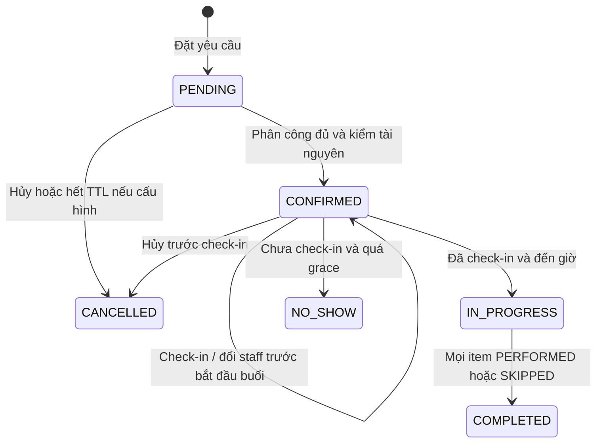

# Rà soát nghiệp vụ Spa — 02/10/2026

Phạm vi đã xác nhận: Spa chăm sóc da/làm đẹp **không xâm lấn**. Tài liệu đối chiếu nghiệp vụ với bản sửa backend hiện tại, tách chức năng đã triển khai, khoảng trống cần thiết kế và chính sách chờ chủ hệ thống duyệt. Đây là đánh giá phần mềm và quy trình vận hành.

Các kết quả build/H2/MySQL được ghi ở báo cáo kiểm thử cuối của đợt triển khai. Việc một test đã được bổ sung không đồng nghĩa test đó đã chạy thành công. Tài liệu này không dùng số lượng test chưa xác nhận để kết luận sẵn sàng vận hành.

## Hiện trạng sau triển khai

Backend đã có luồng đặt lịch, phân công, check-in, bắt đầu buổi, thực hiện từng dịch vụ, kết thúc và lập hóa đơn buổi lẻ. Quota vé đã tách lượt giữ chỗ khỏi lượt sử dụng; tài nguyên giường/phòng/máy được kiểm theo capacity và yêu cầu đã lưu tại thời điểm đặt. Hồ sơ chăm sóc, form theo phiên bản, xác nhận cảnh báo và quyền riêng của lễ tân/kỹ thuật viên đã được bổ sung. Các phần này có trong mã; các giới hạn vận hành còn lại được liệt kê bên dưới.

| Nhóm | Mã đối chiếu | Hành vi hiện tại |
| --- | --- | --- |
| Đặt lịch và vòng đời | [AppointmentServiceImpl](src/main/java/com/core/beautyshop/modules/spa/application/service/impl/AppointmentServiceImpl.java): `bookAppointment`, `updateAppointmentStatus`, `checkIn`, `executeItem`, `rescheduleAppointment`, `cancelAppointment` | Giá/tên dịch vụ và khoảng thời lượng được giữ trên item; xác nhận cần staff đủ kỹ năng/ca; đổi lịch giữ thời lượng đã đặt; ghi lịch sử hành động |
| Quota vé | [TicketUsageService](src/main/java/com/core/beautyshop/modules/spa/application/service/TicketUsageService.java), [AdminSpaTicketService](src/main/java/com/core/beautyshop/modules/spa/application/service/AdminSpaTicketService.java) | Book giữ lượt, hoàn tất item chuyển sang sử dụng, cancel/skip hoàn giữ; no-show theo policy snapshot; điều chỉnh quản trị có reason và idempotency key |
| Chính sách | [SpaBookingPolicyService](src/main/java/com/core/beautyshop/modules/spa/application/service/SpaBookingPolicyService.java) | Lưu TTL/cutoff/grace/no-show policy tại booking; expiry mode tại quyền mua. Mặc định tương thích dữ liệu cũ, chưa tự thêm phí |
| Nhân viên và tài nguyên | [AdminStaffService](src/main/java/com/core/beautyshop/modules/spa/application/service/AdminStaffService.java), [FacilitySchedulingService](src/main/java/com/core/beautyshop/modules/spa/application/service/FacilitySchedulingService.java), [AdminFacilityService](src/main/java/com/core/beautyshop/modules/spa/application/service/AdminFacilityService.java) | Staff và facility dùng mutex; kiểm planned overlap/capacity; START kiểm cả staff/facility còn đang thực hiện dù đã quá giờ dự kiến; guard thay đổi ca/tài nguyên đang có nghĩa vụ |
| Chuẩn bị và quyền truy cập | [SpaAccessService](src/main/java/com/core/beautyshop/modules/spa/application/service/SpaAccessService.java), [SpaPreparationService](src/main/java/com/core/beautyshop/modules/spa/application/service/SpaPreparationService.java) | Form version bất biến, yêu cầu theo item được chụp khi book; khách tự xác nhận form; kỹ thuật viên xác nhận hash hồ sơ hiện tại; ADMIN có override kèm lý do |
| Thanh toán buổi lẻ | [SpaAppointmentCheckoutService](src/main/java/com/core/beautyshop/modules/spa/application/service/SpaAppointmentCheckoutService.java), [SpaCheckoutPolicy](src/main/java/com/core/beautyshop/modules/spa/application/service/SpaCheckoutPolicy.java) | Chỉ invoice buổi COMPLETED; chỉ tính item PERFORMED không dùng vé; snapshot giá/tên; thu CASH/BANK, không giao hàng hoặc trừ tồn kho |
| Nhắc lịch/chăm sóc sau buổi | [SpaNotificationWorkflow](src/main/java/com/core/beautyshop/modules/spa/application/service/SpaNotificationWorkflow.java), [SpaNotificationScheduler](src/main/java/com/core/beautyshop/modules/spa/application/service/SpaNotificationScheduler.java) | Mặc định tắt; outbox/dedup và kiểm trạng thái hiện tại trước gửi; nội dung theo hướng dẫn nhân viên, không tự gửi care notes |

## Ma trận vai trò, hành động và điều kiện

P1 là điều kiện cần trước vận hành trong phạm vi đã cam kết; P2 là quy trình/đối soát cần thiết kế tiếp; P3 là tiện ích. Nhãn **chờ chính sách** không phải kết luận lỗi mã.

| Vai trò / hành động | Điều kiện phải giữ | Hiện trạng và tiêu chí nghiệm thu |
| --- | --- | --- |
| Khách đặt dịch vụ | Dịch vụ hoạt động; ngày/giờ Việt Nam hợp lệ; tổng thời lượng phục vụ/chuẩn bị trong giờ mở cửa; giá/tên/thời lượng không đổi theo catalog | Đã có trên mã. Thay giá/duration sau booking không làm đổi giá và khoảng thời lượng của lịch cũ; request sai rollback toàn bộ quota và allocations |
| Khách đặt chưa chọn staff | PENDING thể hiện yêu cầu chờ duyệt; chưa hứa có nhân viên chắc chắn | Cho phép staff null; confirm phải phân công. Facility/quota có thể đã được giữ. TTL cấu hình được nhưng mặc định 0. **P2 chờ chính sách** về SLA và cách thông báo |
| Lễ tân xác nhận/đổi staff | Tất cả item có staff hoạt động, đúng kỹ năng, ca phủ đầy đủ và không trùng planned slot | Cùng trạng thái CONFIRMED có assignments vẫn kiểm lại. Không đổi staff sau bắt đầu; request có item lạ bị từ chối |
| Lễ tân check-in/bắt đầu buổi | CONFIRMED, ngày check-in đúng ngày hẹn; chỉ bắt đầu sau check-in và giờ bắt đầu buổi | Lưu check-in actor/time và actual start buổi. Không chuyển tương lai thành đang phục vụ; không NO_SHOW khách đã check-in |
| Kỹ thuật viên START item | Được phân công qua `Staff.userId`; item PLANNED; item trước đã ghi kết quả; không có item khác đang thực hiện trong buổi | START kiểm staff còn đang phục vụ khách khác, facility actual capacity/bảo trì và chuẩn bị bắt buộc. Planned slot đã hết không tự giải phóng item còn IN_PROGRESS |
| Kỹ thuật viên hoàn thành/bỏ item | IN_PROGRESS→PERFORMED; PLANNED→SKIPPED cần reason; ghi actual start/end và actor | PERFORMED tiêu thụ lượt vé, SKIPPED hoàn giữ; gọi lại cùng kết quả không trừ thêm. Không được dùng PERFORMED để biểu diễn dịch vụ dừng giữa chừng |
| Lễ tân kết thúc buổi | Mọi item phải PERFORMED hoặc SKIPPED | Không hoàn tất lịch khi còn item chưa ghi kết quả. Lưu actual completion; chỉ sau đó invoice buổi lẻ |
| Khách/lễ tân hủy hoặc đổi giờ | Chỉ PENDING/CONFIRMED, chưa check-in; customer cutoff theo snapshot; quản lý ghi lý do ngoại lệ khi vượt cutoff | Đổi lịch giữ duration snapshot, kiểm lại ca/quota expiry/facility; thiếu tài nguyên rollback giờ và allocations. Hủy hoàn lượt RESERVED; không đổi dịch vụ trong endpoint reschedule |
| Lễ tân ghi NO_SHOW | Chỉ CONFIRMED, chưa check-in, đã qua giờ bắt đầu + grace, có reason | `FORFEIT`/`RELEASE` theo policy lúc đặt. Có ledger riêng; không suy ra đã phục vụ hoặc đã thu phí tiền |
| Khách hoàn thành form | Own appointment; đúng form version đã chụp; đủ kiểu câu trả lời và acknowledgment | Form responses append-only; không sửa bằng chứng sau item START. USER/CUSTOMER không đọc private care notes |
| Kỹ thuật viên đọc cảnh báo | Chỉ item được phân công; đọc bản hồ sơ hiện tại trước START nếu warningsRequired | Hash hồ sơ/form thay đổi làm acknowledgment cũ không đủ; ADMIN override cần reason/history. Legacy booking không tự bị áp yêu cầu mới |
| Quản lý cấu hình resource/form | Chỉ ADMIN; sửa catalog không viết lại yêu cầu đã lưu của lịch cũ | Một dịch vụ có thể cần bed+machine đồng thời; default không ràng buộc resource/form cho legacy. Xem [quản lý tài nguyên](SPA_RESOURCE_MANAGEMENT.md) |
| Lễ tân thu tiền buổi lẻ | Invoice dựa trên item PERFORMED không dùng vé và giá đã đặt; một appointment gắn một visit order | CASH có mã nhận tiền/idempotency; BANK dùng luồng thanh toán; retry không tạo invoice/receipt trùng. Không thu lại tiền gói khi redeem vé |
| Quản lý gia hạn/bù lượt | Vé paid, không revoked; service còn phục vụ; total/used/reserved theo ticket và entitlement nhất quán | Reason + key chống lặp; cùng key khác nội dung bị từ chối; vé vô thời hạn giữ expiry null; không revive quyền bị thu hồi |
| Quản lý ngưng dịch vụ/nhân viên/tài nguyên | Không làm mất khả năng thực hiện nghĩa vụ tồn tại | Guard service kiểm lịch chưa kết thúc, quyền vé chưa hết hạn và order chưa issue; guard ca/resource kiểm lịch đang dùng. Không tự chuyển dịch vụ hoặc tự hoàn tiền |

`ROLE_SPA_RECEPTION` quản lý lễ tân. `ROLE_SPA_THERAPIST` chỉ thao tác/xem lịch được phân công qua Staff.userId. `CS_STAFF` đọc hồ sơ chăm sóc trong phạm vi CRM, không thay lễ tân hoặc therapist. Legacy `ROLE_STAFF` còn quyền lễ tân/thực hiện trong giai đoạn tương thích; chỉ ADMIN quản lý form policy/override. Khi rollout cần rà các tài khoản STAFF cũ và cấp quyền theo nhiệm vụ, đồng thời gỡ STAFF khi chuyển sang quyền chuyên biệt; chỉ thêm role mới vẫn giữ quyền STAFF rộng.

## Luồng trạng thái và quota

Trong mỗi buổi, item đi từ PLANNED→IN_PROGRESS→PERFORMED, hoặc PLANNED→SKIPPED. No-show toàn lịch ghi NO_SHOW cho item. Dữ liệu lịch sử không đủ bằng chứng được đánh dấu `LEGACY_FINALIZED`; không giả tạo actual start/end hoặc performer.

Tổng quyền lợi = available + reserved + used. Book tạo RESERVED, hoàn thành item chuyển RESERVED→REDEEMED, hủy/bỏ item chuyển RESERVED→RELEASED. No-show có thể chuyển RESERVED→FORFEITED hoặc RELEASED theo snapshot; **used không đồng nghĩa mọi lượt đều đã phục vụ**, vì có no-show forfeiture và số dư lịch sử. Ledger movement phân biệt từng trường hợp.

Migration V31 chỉ chuyển phần giữ chỗ chứng minh được từ active appointments sang reserved. Preflight dừng khi counters/entitlements lịch sử không đối chiếu được, trước thay schema ứng dụng hoặc cập nhật counters. Completed history giữ LEGACY_FINALIZED và không được dùng làm bằng chứng actual execution. Có hai regression upgrade V30→V31 trong [OperationalMigrationIntegrityTest](src/test/java/com/core/beautyshop/OperationalMigrationIntegrityTest.java); kết quả thực thi nằm ở báo cáo kiểm thử cuối.

## Khoảng trống vận hành cần thiết kế tiếp

| Ưu tiên / tình huống | Mốc mã và giới hạn hiện tại | Dự thảo hành động và tiêu chí nghiệm thu |
| --- | --- | --- |
| **P2: dừng dịch vụ đang làm** | `AppointmentServiceImpl.executeItem`: IN_PROGRESS chỉ chuyển PERFORMED; lịch IN_PROGRESS chỉ hoàn tất khi mọi item đã có kết quả | Đề xuất action `STOP_SERVICE` với outcome `ABORTED`/`PARTIALLY_PERFORMED`, actual end, reason và người duyệt. Giải phóng actual staff/facility; quyết định quota/tiền riêng theo policy đã duyệt. Không đổi thành PERFORMED giả; retry không nhân đôi movement |
| **P2: thay danh sách dịch vụ trong buổi** | Reschedule chỉ đổi giờ, không thay service/ticket/giá hoặc thêm item | Đề xuất `REPLACE_PLANNED_ITEMS` trước START: tính lại snapshot giá/duration/form/resource, hoàn reserved cũ và giữ mới trong một giao dịch; kiểm consent khi thay quy trình. Không thay item đã thực hiện; thất bại giữ nguyên toàn lịch |
| **P2: buổi lẻ cần cọc/thu trước/phí hủy** | `SpaCheckoutPolicy.defaults`: invoice sau COMPLETED, deposit/cancel/no-show fee tắt | Thiết kế deposit ledger, liên kết nghĩa vụ invoice, điều chỉnh/hoàn được duyệt. Không suy khoản thu hoặc trừ tiền từ chỉ một trạng thái lịch; mức phí và thời điểm còn chờ duyệt |
| **P2: hoàn gói đã dùng một phần** | `SpaOrderCancellationListener` không cho thu hồi gói đã dùng; reserved và execution nay có thông tin riêng | Tính đề nghị hoàn từ purchase snapshot, tách reserved/performed/forfeited và các khoản đã hoàn. Chỉ áp công thức/thẩm quyền sau khi duyệt; không remap quota hoặc hoàn tự động |
| **P2: ngưng bán mới nhưng phục vụ khách cũ** | `BeautyService.isActive` vẫn dùng chung; `AdminSpaCatalogService.requireNoServiceObligations` chặn retire khi còn nghĩa vụ | Tách sellable/fulfillable, ngày hiệu lực và phương án đóng nghĩa vụ. Khách mới không đặt được khi ngưng bán; quyền cũ vẫn phục vụ theo cam kết hoặc có thỏa thuận đổi/hoàn riêng |
| **P2: khách mới đến trực tiếp** | `bookAppointment` lấy người dùng từ phiên đăng nhập, chưa có receptionist tạo customer+appointment cho walk-in | Thiết kế tiếp nhận khách mới, tra trùng số liên hệ, xác minh/thu thập thông tin phù hợp và consent đúng người. Không bắt lễ tân giả đăng nhập khách; không tạo hai hồ sơ vì retry |
| **P2: lịch thực tế kéo dài và điều phối** | START chặn actual staff/facility đang bận, nhưng chưa có workflow điều chỉnh hàng đợi và ETA cho lịch sau | Thêm cảnh báo chạy quá planned end, gợi ý staff/resource khác và thông báo giờ mới có xác nhận. Giữ snapshot/actual riêng; không âm thầm đổi cam kết hoặc lấy tài nguyên khách khác |
| **P2: lỗi nhắc lịch khi đổi A→B→A** | `SpaNotificationWorkflow.enqueueReminder` dedup theo appointment/date/time; event A bị drop khi ở B thì quay lại A không enqueue lại | Thêm revision tăng sau mỗi đổi lịch vào message/dedup; consumer kiểm revision hiện hành. Nghiệm thu: reminder A cũ bị drop, quay lại A vẫn có reminder mới và retry không gửi trùng |
| **P2: rút đồng ý/thu hồi ngoại lệ** | `SpaPreparationService.submit` chỉ nhận acknowledged=true; chưa có withdrawal hoặc revoke override. `requireReadyForStart` cho override bỏ qua cả form và warnings | Thiết kế quyết định append-only, cập nhật readiness/hash và chặn START khi đồng ý đã rút. Chốt loại yêu cầu được override; không lấy quyền quản lý thay bằng chứng đồng ý của khách |
| **Trước bật notifications: transport/replay** | `NotificationServiceImpl.sendEmail` có thể return bình thường khi mail tắt/thiếu sender; inbox/dispatch vẫn commit chống lặp. Recheck không khóa appointment xuyên SMTP | Cấu hình và smoke SMTP trước bật job; bổ sung trạng thái chưa gửi và replay có kiểm soát, không tự replay event log-only khi bật SMTP sau đó. Mô tả giới hạn race giữa recheck và gửi |
| **P3: hiệu năng phân bổ lớn** | `FacilitySchedulingService.assignInternal` khóa tất cả facility chưa xóa, đọc occupancy theo từng facility | Đủ cho tập tài nguyên nhỏ; đo trước tối ưu. Khi mở nhiều chi nhánh cần scope cơ sở và khóa tập candidate phù hợp, giữ thứ tự thống nhất và regression concurrent last-capacity |

Các mục trên là khoảng trống/mô hình tiếp theo, không được trình bày thành lỗi đã tái hiện hoặc tự triển khai chính sách tài chính.

## Dự thảo chính sách để duyệt

Chủ hệ thống đã đồng ý nhận đề xuất. Bảng này là **DRAFT**, chưa là quyết định nghiệp vụ; không gán số phút, mức phí hoặc công thức tiền khi chưa duyệt. Khả năng cấu hình đã có trong mã không đồng nghĩa một giá trị chính sách mới đã được áp dụng.

| Chủ đề | Đề xuất | Mặc định/giới hạn mã hiện tại |
| --- | --- | --- |
| PENDING chưa phân công | Thông báo là yêu cầu chờ duyệt, chưa cam kết staff; TTL và SLA cấu hình, hết TTL hoàn reserved | TTL 0 giữ tương thích, tức chưa tự hết hạn; facility/quota có thể đang giữ |
| Hủy/đổi lịch | Customer cutoff cấu hình; quản lý ngoại lệ có reason; policy snapshot theo booking | Cutoff 0 giữ quy tắc trước giờ bắt đầu; check-in chặn hủy/đổi |
| No-show | Chỉ đánh dấu sau start+grace, kiểm check-in; phân biệt no-show quota với phí tiền | Grace 0; quota FORFEIT tương thích lịch sử hoặc RELEASE theo cấu hình; chưa tự thu phí |
| Giữ và sử dụng lượt | Reserve lúc booking, redeem từng item đã thực hiện, release cancel/skip; đối soát theo movement | Mô hình đã triển khai; không gán legacy used thành performed |
| Hạn vé | Khuyến nghị SERVICE_START cho điều khoản mua mới nếu được duyệt; ngoại lệ quyền legacy cần quyết định riêng | BOOKING_TIME mặc định; purchase/ticket giữ expiry mode; không đổi hồi tố vé cũ |
| Thu buổi lẻ | Chốt sau COMPLETED cho item PERFORMED không dùng vé; VND làm tròn tổng invoice | Đã có invoice/thu CASH/BANK; cọc/phí hủy/no-show tắt |
| Hoàn một phần | Dựa purchase snapshot và phần reserved/performed/forfeited; reason, thẩm quyền và ledger riêng | Chưa có công thức hoàn gói đã dùng một phần; không tự suy giá trị từng lượt |
| Dịch vụ bị dừng | Có outcome riêng, actual end và reason; quyết định thu/quota theo phần đã làm | Chưa có outcome dừng giữa chừng; không đánh PERFORMED để đóng hồ sơ |
| Consent và cảnh báo | Form theo phiên bản, acknowledgment của đúng khách, cảnh báo theo hồ sơ hiện tại; override chỉ người có thẩm quyền | Có trên mã, cấu hình opt-in; không áp tự động yêu cầu mới lên legacy booking |
| Nhắc lịch/chăm sóc sau buổi | Bật sau khi kiểm transport và thông tin liên hệ; nội dung được nhân viên soạn, không gửi private care notes | Default-off; không tự sinh hướng dẫn chuyên môn hoặc kết luận y khoa |

## Ngưng dịch vụ và nhất quán đồng thời

Guard service retirement đã sửa để kiểm mọi lịch chưa kết thúc kể cả ngày hẹn đã qua, quyền vé chưa hết hạn/chưa revoked còn quota và đơn gói chưa issue. Quyền vé và order snapshot được đếm trong **một câu SQL** để không tạo khoảng trống khi chuyển từ purchase snapshot sang ticket. Book/purchase khóa service theo ID tăng dần; extend/compensate giữ ticket lock rồi kiểm/khóa service còn available. Đây là bảo vệ nghĩa vụ hiện có; chưa thay mô hình ngưng bán mới/fulfill quyền cũ.

Issuer hiện được gọi đồng bộ từ `SpaPackagePaidEventListener`, trong transaction payment đang giữ outer order lock; admin cancel cũng giữ order lock và thu hồi ticket sau issuer. Không ghi giả thuyết async replay như lỗi production hiện tại. Nếu sau này thêm worker/reconcile độc lập thì phải kiểm/khóa paid order trước issue và rà lại thứ tự khóa.

Facility dùng mutex theo ID tăng dần, query occupancy thường để tránh JOIN lock ngược appointment. Reservation dựa planned interval và peak concurrent units; execution dựa actual IN_PROGRESS không phụ thuộc planned end. Hủy/skip/hoàn tất giải phóng theo trạng thái tương ứng. JDBC TIME reader dùng Calendar UTC khớp Hibernate; cấu hình thời gian/JVM cần thống nhất khi triển khai nhiều instance và kiểm dữ liệu legacy trước thay cách lưu TIME.

## Diễn giải dashboard

Nguồn: [AdminDashboardService](src/main/java/com/core/beautyshop/modules/dashboard/application/AdminDashboardService.java): `overview`, `revenue`, `spaOccupancy`, `spaFinancials`.

| Chỉ số | Ý nghĩa đúng theo mã hiện tại |
| --- | --- |
| revenue / refundedAmount | revenue là tiền vào gộp từ ledger, kể cả khoản chưa khớp đơn; hoàn hiển thị riêng theo confirmedAt. Chưa phải doanh thu dịch vụ đã thực hiện hoặc lợi nhuận |
| cashAmount / codAmount / bankAmount | CASH và COD được tách; bankAmount là tiền vào còn lại. Không cộng lại khoản bán gói khi redeem vé |
| totalOrders / paidOrders / AOV | totalOrders theo createdAt; paidOrders/AOV theo paidAt. Không lấy hai tập khác thời điểm làm tỷ lệ mà không giải thích |
| scheduledMinutes | Tổng phút ca SCHEDULED; chưa chứng minh đủ mọi kỹ năng/resource cho từng khung giờ |
| bookedMinutes / occupancyRatePercent | Planned interval item có staff trong CONFIRMED/IN_PROGRESS/COMPLETED, loại SKIPPED/NO_SHOW; có cả chuẩn bị. Là độ lấp lịch, không phải actual execution |
| servedMinutes / servedRatePercent | Chỉ item PERFORMED có actual start/end, dùng thời gian thực tế; legacy không có actual không được cộng như đã đo |
| reservedMinutes | Planned interval có staff của PENDING/CONFIRMED/IN_PROGRESS, loại SKIPPED/NO_SHOW. Là phút lịch giữ chỗ; không phải ticket reservedSessions |
| legacyFinalizedMinutes | Planned interval của completed LEGACY_FINALIZED; tách riêng do thiếu actual evidence |
| noShowMinutes / noShowAppointments | Planned minutes và số lịch NO_SHOW; không chứng minh đã thu phí tiền hoặc đã phục vụ |
| overCapacityMinutes / overCapacity | Chênh tổng bookedMinutes so tổng scheduledMinutes; false không bảo đảm từng staff/bed/machine hoặc từng khung giờ đều đủ capacity |
| spaFinancials.outstandingInvoices / outstandingAmount | Số dư hiện tại, không lọc theo ngày: visit invoice COMPLETED, payment PENDING và total lớn hơn paid |
| spaFinancials.unbilledCompletedVisits / unbilledAmount | Buổi COMPLETED có item PERFORMED không dùng vé và chưa invoice; cộng giá snapshot rồi làm tròn tổng từng buổi |
| spaFinancials.legacyVisitsRequiringReconciliation | Buổi COMPLETED có LEGACY_FINALIZED chưa invoice; chỉ đếm, không suy tiền hoặc actual execution |

Báo cáo vận hành tiếp theo nên tách bán gói, thu buổi lẻ, quyền trả trước còn lại, reserved/redeemed/forfeited, actual execution và utilization theo tài nguyên. Các tập thời gian khác nhau cần nhãn rõ để người quản lý đối soát đúng.
