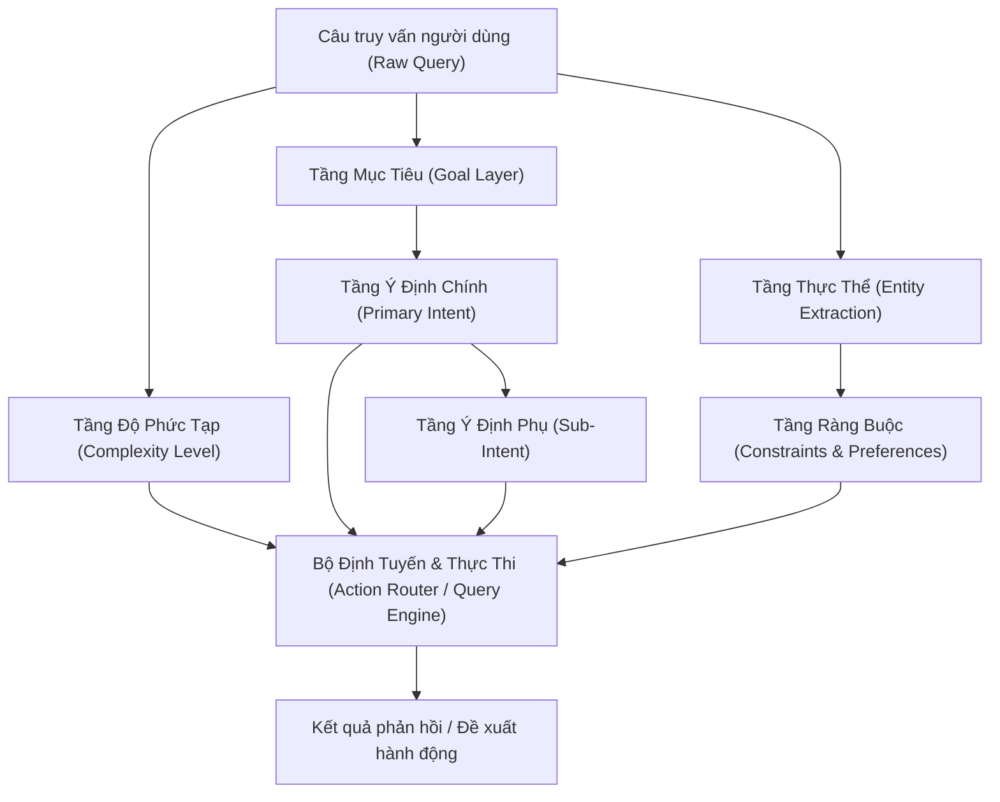

# TẦNG HIỂU Ý ĐỊNH NGƯỜI DÙNG (USER INTENT UNDERSTANDING LAYER)

Tài liệu này định nghĩa cấu trúc phân tầng nhận diện ngữ nghĩa và ý định của người dùng trong hệ thống chatbot tư vấn mỹ phẩm, chăm sóc da (skincare) và dịch vụ làm đẹp.

---

## I. TỔNG QUAN KIẾN TRÚC PHÂN TẦNG (HIERARCHICAL ARCHITECTURE)

Hệ thống phân tách quá trình thấu hiểu câu truy vấn của người dùng thành **6 tầng chính**:



1. **Tầng Độ Phức Tạp (Complexity Layer):** Đánh giá mức độ phức tạp của câu truy vấn để lựa chọn pipeline xử lý tối ưu (từ tra cứu SQL trực tiếp đến suy luận chuỗi nhiều bước CoT).
2. **Tầng Mục Tiêu (Goal Layer):** Xác định động cơ gốc rễ và hành vi cốt lõi mà người dùng muốn đạt được (Tìm kiếm, Điều trị, Đánh giá, Đặt lịch...).
3. **Tầng Ý Định Chính (Primary Intent Layer):** Phân loại ngữ cảnh tác vụ cụ thể vào 1 trong 15 nhóm nghiệp vụ chính.
4. **Tầng Ý Định Phụ (Sub-Intent Layer):** Đi sâu vào nhu cầu chuyên biệt (trị mụn, giảm thâm, cấp ẩm, phục hồi...).
5. **Tầng Thực Thể (Entity Layer):** Bóc tách các từ khóa danh từ (tên sản phẩm, thương hiệu, hoạt chất, loại da...).
6. **Tầng Ràng Buộc (Constraint Layer):** Chuẩn hóa các tiêu chí lọc cứng (Hard filters) và tiêu chí ưu tiên/loại trừ (Soft & Negative preferences) để phục vụ câu truy vấn dữ liệu.

---

## II. TẦNG MỤC TIÊU (GOAL LAYER)

Tầng mục tiêu mô tả động cơ cấp cao nhất chi phối toàn bộ cuộc hội thoại:

```
MỤC_TIÊU
├── TÌM_THÔNG_TIN
├── TÌM_SẢN_PHẨM
├── ĐIỀU_TRỊ
├── SO_SÁNH
├── KIỂM_TRA
├── GIẢI_THÍCH
├── ĐÁNH_GIÁ
├── XÂY_DỰNG
└── ĐẶT_LỊCH
```

### Bảng chi tiết Tầng Mục Tiêu

| Mục tiêu | Định nghĩa & Ý nghĩa | Ví dụ câu hỏi thực tế |
| :--- | :--- | :--- |
| **`TÌM_THÔNG_TIN`** | Người dùng muốn tra cứu dữ liệu, đặc tính, cách dùng hoặc xuất xứ của một đối tượng cụ thể. | *"Kem dưỡng B5 La Roche-Posay có mấy loại dung tích?"* |
| **`TÌM_SẢN_PHẨM`** | Người dùng muốn tìm danh sách các sản phẩm phù hợp với nhu cầu, danh mục hoặc thương hiệu. | *"Tìm cho mình kem chống nắng không cồn giá dưới 400k"* |
| **`ĐIỀU_TRỊ`** | Người dùng tìm kiếm giải pháp giải quyết một vấn đề da bệnh lý hoặc thẩm mỹ cụ thể. | *"Mặt mình đang nổi nhiều mụn viêm bọc thì nên dùng hoạt chất gì?"* |
| **`SO_SÁNH`** | Người dùng muốn đặt 2 hoặc nhiều đối tượng lên bàn cân để chọn ra phương án tối ưu. | *"Serum HA Hyalu B5 và Vichy Mineral 89 cái nào cấp nước tốt hơn?"* |
| **`KIỂM_TRA`** | Người dùng muốn xác thực tính tương thích, kiểm tra hạn dùng, thành phần dị ứng hoặc đơn hàng. | *"BHA của Paula's Choice có dùng chung với Retinol cùng buổi được không?"* |
| **`GIẢI_THÍCH`** | Người dùng cần hiểu sâu về cơ chế sinh học, nguyên lý tác dụng của hoạt chất hoặc hiện tượng da. | *"Vì sao dùng BHA lại bị đẩy mụn (purging)?"* |
| **`ĐÁNH_GIÁ`** | Yêu cầu phân tích tính hợp lý, rủi ro kích ứng của chu trình hiện tại hoặc một sản phẩm với loại da. | *"Da dầu mụn dùng dầu tẩy trang Shu Uemura màu nâu có ổn không?"* |
| **`XÂY_DỰNG`** | Yêu cầu thiết kế chu trình chăm sóc da hoàn chỉnh theo từng bước sáng/tối. | *"Lên giúp mình routine trị nám cho người mới bắt đầu"* |
| **`ĐẶT_LỊCH`** | Ý định chốt hẹn, đăng ký lịch soi da hoặc làm dịch vụ spa làm đẹp. | *"Mình muốn hẹn lịch soi da chuyên sâu vào sáng thứ 7 tuần này"* |

---

## III. TẦNG Ý ĐỊNH CHÍNH (PRIMARY INTENT LAYER)

Tầng ý định chính ánh xạ câu truy vấn vào một trong 15 danh mục nghiệp vụ đã được chuẩn hóa:

| Tên tiếng Việt | Ý nghĩa | Ví dụ câu hỏi minh họa |
| :--- | :--- | :--- |
| **`THÔNG_TIN_SẢN_PHẨM`** | Hỏi thông tin cơ bản về sản phẩm | *"Kem chống nắng Anessa vàng có dung tích bao nhiêu ml, xuất xứ từ đâu?"* |
| **`HỎI_ĐÁP_SẢN_PHẨM`** | Hỏi một vấn đề cụ thể về sản phẩm | *"Kem dưỡng Cerave bản Pháp khác gì bản Mỹ?", "Sản phẩm này có mùi hương liệu không?"* |
| **`THÔNG_TIN_THÀNH_PHẦN`** | Hỏi sản phẩm có/chứa thành phần gì | *"Serum The Ordinary Niacinamide 10% có chứa cồn hoặc paraben không?"* |
| **`TÁC_DỤNG_THÀNH_PHẦN`** | Hỏi thành phần có tác dụng gì | *"Niacinamide có công dụng gì đối với lỗ chân lông và thâm mụn?"* |
| **`TƯƠNG_THÍCH_THÀNH_PHẦN`** | Hỏi các thành phần có dùng chung được không | *"AHA có được kết hợp chung với Vitamin C trong cùng một buổi tối không?"* |
| **`PHÙ_HỢP_LÀN_DA`** | Hỏi sản phẩm có phù hợp với da/đối tượng nào | *"Sữa rửa mặt Cetaphil Gentle Cleanser có dùng được cho da dầu mụn không?"* |
| **`VẤN_ĐỀ_DA`** | Người dùng nêu vấn đề da như mụn, thâm, nám... | *"Da em dạo này đổ nhiều dầu, xuất hiện nhiều mụn ẩn ở vùng cằm và trán"* |
| **`TƯ_VẤN_SẢN_PHẨM`** | Muốn tìm/được đề xuất sản phẩm | *"Gợi ý cho mình một loại kem dưỡng ẩm phục hồi tốt sau khi peel da"* |
| **`SO_SÁNH_SẢN_PHẨM`** | So sánh hai hoặc nhiều sản phẩm | *"So sánh nước tẩy trang Bioderma nắp hồng và nắp xanh lá về độ làm sạch"* |
| **`XÂY_DỰNG_CHU_TRÌNH`** | Muốn xây routine skincare | *"Thiết lập giúp mình chu trình skincare buổi sáng tối cho da hỗn hợp thiên khô"* |
| **`PHÂN_TÍCH_CHU_TRÌNH`** | Kiểm tra/phân tích routine đang sử dụng | *"Routine của mình gồm Sữa rửa mặt Cosrx -> BHA Obagi -> Serum B5 -> Kem dưỡng Klairs, có bị xung đột không?"* |
| **`GIÁ_NGÂN_SÁCH`** | Hỏi giá, ngân sách, giá trị sản phẩm | *"Serum Estee Lauder Advanced Night Repair giá bao nhiêu tiền một chai 50ml?"* |
| **`HỖ_TRỢ_ĐƠN_HÀNG`** | Hỏi đơn hàng, giao hàng, đổi trả... | *"Đơn hàng #10423 của mình bao giờ giao đến nơi?", "Chính sách đổi trả sản phẩm lỗi"* |
| **`DỊCH_VỤ_LÀM_ĐẸP`** | Hỏi về dịch vụ làm đẹp | *"Bên mình có gói liệu trình nặn mụn chuẩn y khoa và peel da sinh học không?"* |
| **`ĐẶT_LỊCH`** | Muốn đặt lịch dịch vụ | *"Mình muốn đặt lịch chăm sóc da vào 14h chiều mai tại chi nhánh Quận 1"* |

---

## IV. TẦNG Ý ĐỊNH PHỤ (SUB-INTENT LAYER)

Ý định phụ giúp tinh chỉnh mục tiêu tìm kiếm và tư vấn sâu theo từng bài toán chuyên môn.

### 1. Phân cấp nhóm `TƯ_VẤN_SẢN_PHẨM`

```
TƯ_VẤN_SẢN_PHẨM
├── TRỊ_MỤN
├── GIẢM_THÂM
├── DƯỠNG_ẨM
├── CHỐNG_LÃO_HÓA
├── LÀM_SÁNG_DA
├── KIỂM_SOÁT_DẦU
├── PHỤC_HỒI_DA
└── CHỐNG_NẮNG
```

| Ý định phụ | Mục tiêu chăm sóc | Hoạt chất / Nhóm sản phẩm ưu tiên |
| :--- | :--- | :--- |
| **`TRỊ_MỤN`** | Gom cồi, giảm viêm, diệt khuẩn P.acnes | BHA (Salicylic Acid), Benzoyl Peroxide, Tea Tree, Azelaic Acid |
| **`GIẢM_THÂM`** | Làm mờ thâm đỏ (PIE) và thâm đen (PIH) | Niacinamide, Vitamin C, Tranexamic Acid, Alpha Arbutin |
| **`DƯỠNG_ẨM`** | Cấp nước, khóa ẩm bề mặt, chống bong tróc | Hyaluronic Acid (HA), Glycerin, Ceramide, Squalane |
| **`CHỐNG_LÃO_HÓA`** | Tăng sinh collagen, mờ nếp nhăn, săn chắc da | Retinol, Tretinoin, Peptides, Bakuchiol, Coenzyme Q10 |
| **`LÀM_SÁNG_DA`** | Đều màu da, ức chế enzyme Tyrosinase tạo melanin | Vitamin C tinh khiết (L-AA), Kojic Acid, Glutathione, Niacinamide |
| **`KIỂM_SOÁT_DẦU`** | Điều tiết tuyến bã nhờn, làm thông thoáng chân lông | Zinc PCA, Niacinamide, BHA, Đất sét (Clay), Bột khoáng kiềm dầu |
| **`PHỤC_HỒI_DA`** | Tái tạo hàng rào bảo vệ da, làm dịu kích ứng, phục hồi da sau peel/treatment | Vitamin B5 (Panthenol), Centella Asiatica (Rau má), Ceramide, Madecassoside |
| **`CHỐNG_NẮNG`** | Bảo vệ da toàn diện trước tia UVA, UVB, ánh sáng xanh (HEV) | Màng lọc vật lý (Zinc Oxide, Titanium Dioxide) hoặc hóa học quang phổ rộng (Tinosorb, Uvinul) |

---

### 2. Mở rộng Ý định phụ cho các nhóm tác vụ khác

#### Nhóm `HỖ_TRỢ_ĐƠN_HÀNG`
```
HỖ_TRỢ_ĐƠN_HÀNG
├── TRA_CỨU_VẬN_CHUYỂN (Theo dõi trạng thái bưu kiện)
├── HỦY_ĐƠN_HÀNG (Hủy đơn trước khi đóng gói)
├── ĐỔI_TRẢ_BẢO_HÀNH (Sản phẩm vỡ, lỗi, dị ứng)
└── HÌNH_THỨC_THANH_TOÁN (COD, chuyển khoản, thẻ tín dụng)
```

#### Nhóm `DỊCH_VỤ_LÀM_ĐẸP` & `ĐẶT_LỊCH`
```
DỊCH_VỤ_LÀM_ĐẸP
├── SOI_DA_TƯ_VẤN (Phân tích chỉ số da chuyên sâu)
├── LIỆU_TRÌNH_MỤN (Lấy nhân mụn, chiếu ánh sáng sinh học)
├── PEEL_DA_SINH_HỌC (Tái tạo bề mặt da, mờ thâm)
└── PHỤC_HỒI_CHUYÊN_SÂU (Điện di tinh chất, cấp ẩm đa tầng)
```

---

## V. TẦNG THỰC THỂ (ENTITY LAYER)

Tầng thực thể đảm nhiệm việc nhận diện và trích xuất các từ khóa danh từ có cấu trúc từ câu chat của khách hàng:

```
THỰC_THỂ
├── SẢN_PHẨM
├── THƯƠNG_HIỆU
├── THÀNH_PHẦN
├── LOẠI_DA
├── VẤN_ĐỀ_DA
├── DỊCH_VỤ
├── GIÁ
└── ĐỐI_TƯỢNG
```

### Bảng chi tiết Tầng Thực Thể

| Thực thể | Mô tả & Chuẩn hóa | Giá trị chuẩn hóa / Ví dụ |
| :--- | :--- | :--- |
| **`SẢN_PHẨM`** | Tên sản phẩm, dòng sản phẩm, hoặc định dạng sản phẩm (Form factor/Category). | *Serum, Kem dưỡng, Nước tẩy trang, Toner, Gel rửa mặt, "Baume B5+"* |
| **`THƯƠNG_HIỆU`** | Tên thương hiệu mỹ phẩm chính thức. | *La Roche-Posay, Paula's Choice, Innisfree, Cerave, The Ordinary, Vichy, Bioderma* |
| **`THÀNH_PHẦN`** | Hoạt chất sinh hóa (Active ingredients) hoặc chất phụ gia cần tìm hoặc cần tránh. | *BHA (Salicylic Acid), Niacinamide, Retinol, Hyaluronic Acid, Cồn khô (Alcohol), Hương liệu (Fragrance)* |
| **`LOẠI_DA`** | Phân loại nền da người dùng (theo Fitzpatrick / Baumann). | *`oily` (da dầu), `dry` (da khô), `combination` (da hỗn hợp), `sensitive` (da nhạy cảm), `normal` (da thường)* |
| **`VẤN_ĐỀ_DA`** | Tình trạng da hoặc bệnh lý biểu bì người dùng muốn cải thiện. | *Mụn viêm, Mụn ẩn, Thâm mụn, Tàn nhang, Lão hóa, Đổ dầu thừa, Lỗ chân lông to, Da khô tróc, Da đỏ kích ứng* |
| **`DỊCH_VỤ`** | Gói dịch vụ spa, thẩm mỹ hoặc chăm sóc da. | *Soi da, Lấy nhân mụn y khoa, Peel da AHA/BHA, Liệu trình điện di vitamin C, Cấp ẩm phục hồi Oxy Jet* |
| **`GIÁ`** | Ngân sách, khoảng giá người dùng có thể chi trả. | *Dưới 300.000đ, 500k - 1 triệu, Tầm trung, Phân khúc cao cấp, Học sinh sinh viên* |
| **`ĐỐI_TƯỢNG`** | Nhóm người dùng đặc biệt cần lưu ý tính an toàn. | *Phụ nữ mang thai (bầu), Mẹ cho con bú, Nam giới, Tuổi dậy thì (teenager), Người mới bắt đầu (beginner)* |

---

## VI. TẦNG RÀNG BUỘC (CONSTRAINT LAYER)

Tầng ràng buộc chuyển hóa các thực thể và mong muốn của người dùng thành các điều kiện kỹ thuật cụ thể để phục vụ việc lọc dữ liệu (SQL Filtering) hoặc xếp hạng tìm kiếm (Vector / Semantic Re-ranking):

```
RÀNG_BUỘC
├── LOẠI_DA
├── VẤN_ĐỀ_DA
├── NGÂN_SÁCH
├── THƯƠNG_HIỆU
├── LOẠI_SẢN_PHẨM
├── THÀNH_PHẦN
├── ĐỐI_TƯỢNG
└── YÊU_CẦU_ĐẶC_BIỆT
```

### Bảng chi tiết Tầng Ràng Buộc

| Loại ràng buộc | Phân loại kỹ thuật | Mục đích & Quy tắc áp dụng | Ví dụ dữ liệu chuẩn hóa |
| :--- | :--- | :--- | :--- |
| **`LOẠI_DA`** | Hard Filter / Preference | Chỉ lọc hoặc ưu tiên các sản phẩm tương thích với loại da người dùng. | `skin_type: "oily"` (chỉ chọn sản phẩm ghi nhận dành cho da dầu/hỗn hợp) |
| **`VẤN_ĐỀ_DA`** | Target / Preference | Định hướng hoạt chất và công dụng chính cần giải quyết. | `concerns: ["acne", "dark_spots"]` (mụn, thâm) |
| **`NGÂN_SÁCH`** | Hard Filter | Lọc mức giá trần, giá sàn hoặc khoảng giá tối đa người dùng có thể chi trả. | `min_price: 200000`, `max_price: 500000` (VND) |
| **`THƯƠNG_HIỆU`** | Hard Filter | Giới hạn sản phẩm thuộc thương hiệu chỉ định cụ thể. | `brand: "La Roche-Posay"` |
| **`LOẠI_SẢN_PHẨM`** | Hard Filter | Định hình dạng thức và bước chăm sóc (Cleanser, Toner, Serum, Cream, Sunscreen...). | `category: "sunscreen"`, `form_factor: "FLUID"` |
| **`THÀNH_PHẦN`** | Hard / Negative Filter | • **Bắt buộc có:** Hoạt chất mong muốn (BHA, Niacinamide...).<br>• **Loại trừ tuyệt đối:** Thành phần gây dị ứng (Alcohol-free, Fragrance-free). | `ingredients_included: ["niacinamide"]`<br>`ingredients_excluded: ["alcohol", "paraben"]` |
| **`ĐỐI_TƯỢNG`** | Safety Rule / Constraint | Áp dụng quy tắc an toàn nghiêm ngặt (chống chỉ định Retinoids, BHA liều cao cho phụ nữ mang thai). | `target_user: "pregnant"` $\rightarrow$ kích hoạt bộ lọc an toàn thai kỳ |
| **`YÊU_CẦU_ĐẶC_BIỆT`** | Preference / Filter | Các tiêu chí thẩm mỹ hoặc chứng nhận đặc thù: Finish lì (matte), không nâng tone (no white cast), thuần chay (vegan), không bết dính. | `target_finish: "matte"`, `cruelty_free: true`, `no_white_cast: true` |

---

## VII. TẦNG ĐỘ PHỨC TẠP (COMPLEXITY LAYER)

Tầng độ phức tạp đánh giá bản chất câu truy vấn để điều hướng câu hỏi đến **Pipeline xử lý tương ứng**, tối ưu hóa giữa tốc độ phản hồi (latency), chi phí tính toán (token cost) và độ sâu suy luận (reasoning depth):

```
ĐỘ_PHỨC_TẠP
├── MỨC_1_ĐƠN_GIẢN
├── MỨC_2_NGỮ_NGHĨA
├── MỨC_3_NHIỀU_RÀNG_BUỘC
├── MỨC_4_NHIỀU_LƯỢT_HỘI_THOẠI
└── MỨC_5_SUY_LUẬN_PHỨC_TẠP
```

### Bảng chi tiết Tầng Độ Phức Tạp

| Cấp độ | Đặc điểm nhận diện | Pipeline xử lý kỹ thuật | Ví dụ câu truy vấn |
| :--- | :--- | :--- | :--- |
| **`MỨC_1_ĐƠN_GIẢN`** | Câu hỏi tra cứu trực diện, 1 đối tượng duy nhất, thông tin có sẵn trong Database hoặc FAQ bảng biểu. | **Direct Database / FAQ Lookup:**<br>SQL exact match hoặc tra cứu bảng thuộc tính đơn giản. Không cần LLM phức tạp. | *"Kem chống nắng Anessa vàng giá bao nhiêu?", "Kem dưỡng Cerave dung tích bao nhiêu ml?"* |
| **`MỨC_2_NGỮ_NGHĨA`** | Diễn đạt bằng ngôn ngữ tự nhiên, cảm giác, từ lóng, viết tắt, không chứa từ khóa danh từ chính xác trong DB. | **Hybrid Semantic Search:**<br>Tạo Dense Vector Embedding (Qdrant) kết hợp BM25 mở rộng từ khóa tương đương. | *"Có kem nào bôi mát mát thấm nhanh không bị nhờn dính mặt mùa hè không?"* |
| **`MỨC_3_NHIỀU_RÀNG_BUỘC`** | Kết hợp đồng thời nhiều điều kiện: Loại da + Ngân sách + Thành phần loại trừ + Nhóm sản phẩm + Thương hiệu. | **Constrained Hybrid Retrieval:**<br>Trích xuất JSON ràng buộc $\rightarrow$ Lọc cứng SQL / Metadata Filter $\rightarrow$ Xếp hạng ngữ nghĩa bằng Vector. | *"Tìm serum B5 phục hồi cho da dầu mụn nhạy cảm giá dưới 400k không cồn của Pháp"* |
| **`MỨC_4_NHIỀU_LƯỢT_HỘI_THOẠI`** | Câu hỏi phụ thuộc vào lịch sử chat (Multi-turn), đại từ thay thế (*"nó"*, *"cái đó"*), hoặc thiếu thông tin cần hỏi làm rõ (Clarification). | **Dialogue State Tracking (DST):**<br>Hợp nhất Context lịch sử hội thoại; nếu thiếu thuộc tính cốt lõi thì phát sinh câu hỏi ngược lại người dùng. | • User: *"Tư vấn kem dưỡng cho mình"*<br>$\rightarrow$ Bot: *"Bạn thuộc loại da nào và có ngân sách khoảng bao nhiêu?"*<br>• User: *"Còn loại nào rẻ hơn cái vừa rồi không?"* |
| **`MỨC_5_SUY_LUẬN_PHỨC_TẠP`** | Đánh giá xung đột dược chất, cân bằng độ pH, thiết lập routine nhiều bước hoặc giải quyết tình trạng da bệnh lý phức tạp. | **Chain-of-Thought (CoT) & Medical Rules:**<br>Kích hoạt LLM Reasoning Agent với bộ tri thức da liễu chuyên sâu và kiểm tra ma trận tương thích hoạt chất. | *"Routine tối nay của mình gồm BHA 2% Obagi -> Retinol 0.5% -> Niacinamide 10% -> Kem B5, thứ tự thoa sao cho đúng và có nguy cơ breakout không?"* |

---

## VIII. MA TRẬN ÁNH XẠ THỰC TẾ (END-TO-END EXAMPLES)

Bảng tổng hợp cách hệ thống phân tích toàn diện 6 tầng từ câu nói của người dùng:

| Câu nói của người dùng | Độ phức tạp | Mục tiêu | Ý định chính & phụ | Thực thể trích xuất | Ràng buộc được kích hoạt |
| :--- | :--- | :--- | :--- | :--- | :--- |
| *"Giá kem B5 La Roche-Posay bao nhiêu vậy shop?"* | **MỨC_1_ĐƠN_GIẢN** | `TÌM_THÔNG_TIN` | **Ý định chính:** `GIÁ_NGÂN_SÁCH`<br>**Ý định phụ:** N/A | • SẢN_PHẨM: B5 Baume<br>• THƯƠNG_HIỆU: La Roche-Posay | • `brand`: "La Roche-Posay"<br>• `product_lookup`: "B5" |
| *"Tìm cho mình kem chống nắng kiềm dầu, bôi lên nhẹ mặt không bị trắng bệch dưới 350k"* | **MỨC_2_NGỮ_NGHĨA** | `TÌM_SẢN_PHẨM` | **Ý định chính:** `TƯ_VẤN_SẢN_PHẨM`<br>**Ý định phụ:** `CHỐNG_NẮNG`, `KIỂM_SOÁT_DẦU` | • SẢN_PHẨM: Kem chống nắng<br>• GIÁ: < 350.000đ | • `category`: "sunscreen"<br>• `max_price`: 350000<br>• `concern`: "oil_control"<br>• `special`: "no_white_cast, lightweight" |
| *"Em đang có bầu, da bị nổi mụn nhiều, tư vấn giúp em kem trị mụn an toàn giá tầm 500k đổ lại, không chứa hương liệu"* | **MỨC_3_NHIỀU_RÀNG_BUỘC** | `ĐIỀU_TRỊ`<br>`TÌM_SẢN_PHẨM` | **Ý định chính:** `TƯ_VẤN_SẢN_PHẨM`<br>**Ý định phụ:** `TRỊ_MỤN` | • SẢN_PHẨM: Kem trị mụn<br>• VẤN_ĐỀ_DA: Mụn<br>• ĐỐI_TƯỢNG: Phụ nữ mang thai<br>• GIÁ: $\le$ 500.000 VNĐ | • `category`: "treatment_cream"<br>• `concerns`: ["acne"]<br>• `max_price`: 500000<br>• `target_user`: "pregnant"<br>• `excluded`: ["fragrance", "retinoid", "high_bha"] |
| *"Tư vấn cho mình một lọ serum phục hồi da"*<br>*(Người dùng chưa nêu loại da, ngân sách)* | **MỨC_4_NHIỀU_LƯỢT_HỘI_THOẠI** | `TÌM_SẢN_PHẨM` | **Ý định chính:** `TƯ_VẤN_SẢN_PHẨM`<br>**Ý định phụ:** `PHỤC_HỒI_DA` | • SẢN_PHẨM: Serum<br>• TÍNH_NĂNG: Phục hồi | • `category`: "serum"<br>• `concerns`: ["recovery"]<br>• **Trạng thái:** `needs_clarification = True`<br>• **Hỏi lại:** Loại da và tầm giá mong muốn |
| *"Routine hiện tại của mình gồm BHA 2% Paula's Choice, Serum Niacinamide 10%, và Retinol 0.5%. Dùng chung một tối được không và nên xếp thứ tự như thế nào để không banh mặt?"* | **MỨC_5_SUY_LUẬN_PHỨC_TẠP** | `ĐÁNH_GIÁ`<br>`KIỂM_TRA`<br>`GIẢI_THÍCH` | **Ý định chính:** `TƯƠNG_THÍCH_THÀNH_PHẦN`<br>**Ý định phụ:** `PHÂN_TÍCH_CHU_TRÌNH` | • THÀNH_PHẦN: BHA (2%), Niacinamide (10%), Retinol (0.5%)<br>• THƯƠNG_HIỆU: Paula's Choice | • `conflict_analysis`: ["bha_retinol", "ph_gap"]<br>• `reasoning_mode`: "CHAIN_OF_THOUGHT"<br>• `action`: Phân tích rủi ro kích ứng và khuyến nghị giãn cách ngày chẵn/lẻ |

---

## IX. ĐỊNH DẠNG CẤU TRÚC JSON ĐẦU RA (OUTPUT SCHEMA)

Cấu trúc chuẩn hóa mà Module Phân Tích Ý Định (NLU / Query Understanding Agent) xuất ra để các module phía sau tiêu thụ:

```json
{
  "raw_query": "Em đang có bầu, da bị nổi mụn nhiều, tư vấn giúp em kem trị mụn an toàn giá tầm 500k đổ lại, không chứa hương liệu",
  "complexity_level": "MỨC_3_NHIỀU_RÀNG_BUỘC",
  "goals": [
    "TÌM_SẢN_PHẨM",
    "ĐIỀU_TRỊ"
  ],
  "primary_intent": "TƯ_VẤN_SẢN_PHẨM",
  "sub_intents": [
    "TRỊ_MỤN"
  ],
  "entities": {
    "product_category": "kem_tri_mun",
    "brands": [],
    "target_concerns": ["mụn"],
    "skin_type": null,
    "target_user": "phu_nu_mang_thai",
    "price_mentioned": 500000,
    "ingredients_mentioned": [],
    "excluded_ingredients": ["hương liệu"]
  },
  "constraints": {
    "category": "treatment_cream",
    "concerns": ["acne"],
    "min_price": null,
    "max_price": 500000,
    "target_user_safety": "pregnant_safe",
    "excluded_ingredients": ["fragrance", "retinoids", "salicylic_acid_gt_2pct"],
    "preferences": {
      "gentle_formula": true
    }
  },
  "dialogue_state": {
    "needs_clarification": false,
    "missing_information": [],
    "clarification_question": null
  },
  "action_routing": "CONSTRAINED_HYBRID_SEARCH_PIPELINE"
}
```
